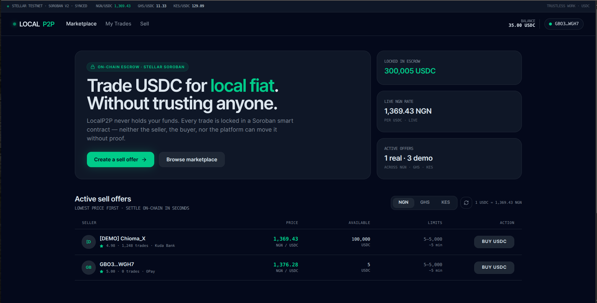
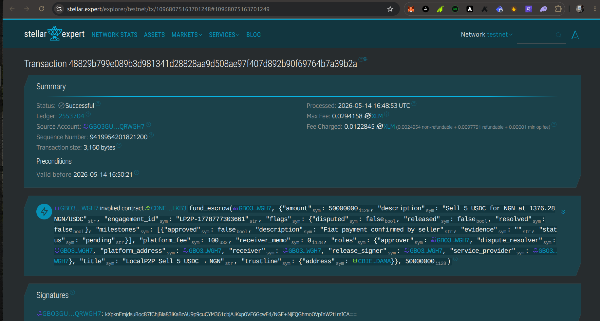
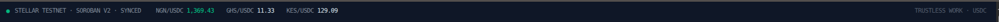

# ProofEscrow:  LocalP2P — Non-Custodial OTC Exchange

> **Censorship-resistant P2P trading of USDC for local fiat (NGN, GHS, KES) — powered by Stellar Soroban smart contracts and Trustless Work.**

---

## 1. The Vision

ProofEcrow(LocalP2P) is a censorship-resistant, non-custodial marketplace for buying and selling stablecoins with local fiat (NGN, GHS, KES). It eliminates the "Escrow Scams" common in centralized P2P by putting the collateral in a smart contract that neither party can touch without proof.

---

## 2. Problem & Solution

### The Problem

- **Escrow Scams:** On many P2P platforms, sellers can "ghost" buyers after receiving fiat, or centralized platform escrows can be frozen or seized due to regulatory pressure.
- **Lack of Privacy:** Centralized exchanges require heavy KYC and can leak sensitive user data, making users vulnerable.
- **Chargeback/Receipt Fraud:** Buyers sometimes use fake screenshots to trick sellers. Without an immutable record of evidence, disputes are hard to resolve fairly.

### The Solution

- **Non-Custodial Security:** Funds are locked in a Soroban Smart Contract. LocalP2P never holds user funds, meaning they cannot be frozen by the platform.
- **Immutable Evidence:** When a buyer pays, they must upload proof to the milestone. This record is stored on IPFS via Pinata, ensuring the Dispute Resolver has a single source of truth.
- **Trustless Payouts:** Once the Seller verifies the fiat and clicks "Approve", the crypto is released instantly. The code enforces the agreement, not a middleman.

---

## 3. Technical Architecture

### Core Primitive
| Property | Value |
|---|---|
| Escrow Type | Single-Release |
| Network | Stellar Testnet |
| Asset | USDC |
| Escrow Provider | Trustless Work API |

### Role Mapping
| Role | Actor | Responsibility |
|---|---|---|
| Funder | Seller | Locks USDC in escrow |
| Service Provider | Buyer | Uploads bank receipt as evidence |
| Approver | Seller | Approves release after confirming fiat |
| Receiver | Buyer's wallet | Receives USDC on release |
| Release Signer | LocalP2P Platform | Triggers the on-chain release |
| Dispute Resolver | Platform Admin | Arbitrates if seller ghosts after receiving fiat |

### The Trade Lifecycle
1. **Initiate** — Seller creates an offer. Platform calls `/deployer/single-release`.
2. **Funding** — Seller signs the XDR to lock USDC in the Soroban contract.
3. **Evidence** — Buyer sends bank transfer and uploads the screenshot to the escrow milestone (pinned to IPFS).
4. **Release** — Seller verifies the bank alert and signs the Approve transaction. USDC releases instantly.

---

## 4. Technology Stack

| Layer | Technology | Rationale |
|---|---|---|
| Frontend | TanStack Start + React 19 | Full-stack, file-based routing, SSR-capable |
| Styling | Tailwind CSS v4 | Utility-first CSS for custom "Trading Desk" UI |
| Escrow Core | Trustless Work REST API | Deploy, fund, approve, dispute on Soroban |
| Wallet | `@creit.tech/stellar-wallets-kit` | Freighter, xBull, Albedo, Rabet, Lobstr, Hana |
| Stellar SDK | `@stellar/stellar-sdk` | XDR signing, Horizon queries, balance fetch |
| Notifications | Pusher | Real-time alerts when buyer uploads payment proof |
| Evidence Storage | Pinata IPFS | Immutable, verifiable bank receipt storage |
| State | Zustand (persist) | Client-side trade and offer state |
| Asset | USDC on Stellar Testnet | Stablecoin for cross-border liquidity |
| Deployment | Vercel (static SPA) | Fast global CDN delivery |

---

## 5. User Flow

### Phase 1 — Listing
1. Seller connects wallet (Freighter / xBull / Albedo etc.)
2. Seller fills in bank details, USDC amount, fiat currency (NGN/GHS/KES), and margin
3. Platform calls `/deployer/single-release` → seller signs deploy XDR → signs fund XDR
4. Offer appears on the Marketplace as "Funded & Active" with live exchange rate

### Phase 2 — Trading
1. Buyer finds the offer, connects wallet, enters USDC amount
2. Buyer sees seller's bank account number and exact fiat amount to send
3. Buyer makes the bank transfer (OPay, Kuda, GTBank, M-Pesa, MTN MoMo, etc.)
4. Buyer uploads screenshot of transfer confirmation → pinned to IPFS → recorded on escrow milestone
5. Seller receives a real-time Pusher notification that payment proof has been submitted

### Phase 3 — Payout
1. Seller checks their bank app and confirms receipt
2. Seller clicks **Approve & Release** → signs approve-milestone XDR → signs release-funds XDR
3. USDC is instantly released from the Soroban contract to the buyer's wallet
4. Both parties can rate each other to build on-chain reputation

---

## 6. Features

- ✅ Non-custodial escrow — platform cannot freeze or steal funds
- ✅ Multi-wallet support — Freighter, xBull, Albedo, Rabet, Lobstr, Hana
- ✅ Live NGN/GHS/KES exchange rates (exchangerate-api.com, 10-min cache)
- ✅ Full Nigerian bank list — OPay, Kuda, PalmPay, Moniepoint, Access, GTBank, Zenith, UBA, Fidelity, Sterling + GHS/KES equivalents
- ✅ IPFS evidence upload via Pinata — immutable proof of payment
- ✅ Real-time seller notifications via Pusher
- ✅ $5 minimum / $5,000 maximum trade limits (aligned with CBN daily transfer thresholds)
- ✅ Large-trade warning at $1,000+ (single-transfer bank limit advisory)
- ✅ In-trade secure messenger
- ✅ Dispute flow — opens on-chain dispute, arbiter reviews IPFS evidence
- ✅ Demo mode — 100,000 USDC demo liquidity, auto-replenishes (judges can't drain it)
- ✅ Mobile-first responsive UI
- ✅ Transaction history (My Trades)

---

## 7. Demo

### Live Demo
> *(Deploy link — add after Vercel deployment)*

### Demo Video
> *(1-minute walkthrough — add link)*

### Successful Testnet Contract Interaction
**Transaction Hash:** `10968075163701248`  
**Explorer Link:** [View on Stellar Expert (Testnet)](https://stellar.expert/explorer/testnet/tx/10968075163701248#10968075163701249)

### Screenshots

| Wallet Connected | Balance Displayed |
|---|---|
| *(add screenshot)* | *(add screenshot)* |



| Marketplace with Live Rates | Trade Room — Evidence Upload |
|---|---|
| *(add screenshot)* | *(add screenshot)* |



| Mobile Responsive View | Successful Testnet Transaction |
|---|---|
| | [Stellar Expert ↗](https://stellar.expert/explorer/testnet/tx/10968075163701248#10968075163701249) |

---

## 7.5 Payment Evidence — What to Upload & How to Get It

The **payment evidence** is the screenshot a buyer uploads to prove they sent the fiat money. It is the core anti-fraud mechanism of LocalP2P.

### What it is
A screenshot of your bank transfer confirmation — specifically:
- The **debit alert SMS/notification** from your bank app
- OR the **transfer success screen** from OPay, Kuda, PalmPay, GTBank, M-Pesa, MTN MoMo etc.
- OR the **transaction receipt** showing the amount, recipient account, and timestamp

### How to get it — Real Trade
1. Open your banking app (OPay, Kuda, GTBank, Access, M-Pesa, etc.)
2. Send the **exact fiat amount** shown in the trade room to the seller's account number
3. After the transfer succeeds, your bank shows a confirmation screen — **screenshot that screen**
4. Return to the LocalP2P trade room and upload the screenshot

> 💡 **The screenshot of the successful bank transfer is the file to upload.** It is your proof of payment — the seller sees it, the arbiter sees it, and it is permanently stored on IPFS so it can never be altered or disputed.

### How to get it — Testnet / Hackathon Demo
For the hackathon demo, you are not sending real fiat. Instead:

1. Open a trade against any offer on the marketplace
2. Go to your Stellar testnet wallet (Freighter) or any banking app
3. **Take a screenshot of any successful transaction** — this simulates the fiat payment confirmation
4. Upload that screenshot as your evidence

**Good screenshots to use for the demo:**
- Screenshot of the [Stellar Expert testnet transaction](https://stellar.expert/explorer/testnet/tx/10968075163701248#10968075163701249) — this is a real on-chain contract call from this project
- Screenshot of your Freighter wallet showing your testnet balance
- Screenshot of the Stellar Laboratory friendbot funding your account
- Screenshot of any successful transfer confirmation from a banking app

> The judges will see the uploaded image appear in the trade room with a timestamp, an IPFS link (on real trades), and the escrow milestone updated — demonstrating the full evidence flow end-to-end.

### How to get it — Demo Mode (no setup needed)
Demo trades skip Pinata entirely. You can upload **any image** from your device:
- A screenshot of anything on your phone or computer
- A photo from your gallery
- The demo mode accepts any image file and displays it immediately in the trade room

### What happens after upload

| Trade Type | What happens |
|---|---|
| **Demo trade** | Stored as a local browser object URL, shown in the UI immediately — no IPFS, no API call |
| **Real trade** | Uploaded to Pinata → stored permanently on IPFS → CID URL recorded on the Trustless Work escrow milestone → seller sees it → arbiter can verify it at any time |

### The IPFS link
After a real upload, the evidence is permanently accessible at:
```
https://gateway.pinata.cloud/ipfs/bafybeig...
```
This link is **immutable and publicly verifiable** — anyone with it can see the exact screenshot submitted as proof. The seller, buyer, and any arbiter all see the same file. It cannot be altered or deleted.

### Demo walkthrough
1. Open a trade against a demo offer on the marketplace
2. Click **Submit Payment Evidence**
3. Upload any screenshot from your device
4. The image appears in the trade room with a timestamp
5. Click **Approve & Release** (acts as the seller)
6. Trade completes — USDC released on-chain

---

## 8. Setup — Run Locally

### Prerequisites
- [Bun](https://bun.sh) v1.0+
- [Freighter wallet](https://freighter.app) browser extension (or any supported Stellar wallet)
- Stellar testnet account with USDC (get from [Stellar Laboratory](https://laboratory.stellar.org/#account-creator))

### Install & Run

```bash
git clone <repo-url>
cd ProofEscrow-App
bun install
```

Copy the environment file and fill in your keys:

```bash
cp .env.example .env
```

```env
VITE_TRUSTLESS_API_KEY=        # https://app.trustlesswork.com
VITE_PINATA_JWT=               # https://app.pinata.cloud/keys
VITE_PUSHER_KEY=               # https://pusher.com → App Keys
VITE_PUSHER_CLUSTER=eu
VITE_PUSHER_APP_ID=
VITE_PUSHER_SECRET=
VITE_PLATFORM_ADDRESS=         # Your Stellar testnet address (releaseSigner + disputeResolver)
```

```bash
bun run dev
```

Open [http://localhost:3000](http://localhost:3000)

### Build for Production

```bash
bun run build:vercel
```

Output is in `dist/client/` — deploy to Vercel, Netlify, or any static host.

---

## 9. Deploy to Vercel

```bash
npm i -g vercel
vercel
```

Vercel reads `vercel.json` automatically:
- **Build command:** `bun run build:vercel`
- **Output directory:** `dist/client`
- **Rewrites:** all routes → `index.html`

Add the 7 environment variables in Vercel → Settings → Environment Variables.

---

## 10. Contract Addresses & Transaction Hashes

| Item | Value |
|---|---|
| Network | Stellar Testnet |
| Asset | USDC — `GBBD47IF6LWK7P7MDEVSCWR7DPUWV3NY3DTQEVFL4NAT4AQH3ZLLFLA5` |
| Platform Address | `GBO3GUCA3URQXIRFLR4UU47B2DKZZH7232LRJ4RZDTKB34J253QRWGH7` |
| Successful Contract Call | [10968075163701248 on Stellar Expert ↗](https://stellar.expert/explorer/testnet/tx/10968075163701248#10968075163701249) |
| Escrow Type | Single-Release (Trustless Work) |

---

## 11. User Feedback

We'd love your feedback on the demo experience:  
👉 **[Fill out the feedback form](https://forms.gle/6vUwRUaWnBFXxiH57)**

---

## 12. Advanced Features

### IPFS Evidence Storage
Bank receipt screenshots are pinned to IPFS via Pinata before being recorded on the Trustless Work escrow milestone. This creates an immutable, publicly verifiable record that neither party can alter — the arbiter always sees the same proof.

**Implementation:** `src/lib/pinata.ts` → `pinFileToIPFS()` → returns gateway URL → passed to `change-milestone-status` endpoint as `newEvidence`.

### Real-Time Notifications (Pusher)
When a buyer uploads evidence, the seller receives an instant browser notification via Pusher without polling. Each trade has its own channel (`trade-{tradeId}`).

**Implementation:** `src/lib/pusher.ts` — HMAC-SHA256 signed HTTP API trigger + client subscription.

### Live Exchange Rates
NGN/GHS/KES rates are fetched from `exchangerate-api.com` on page load with a 10-minute cache. Offer prices update automatically. The ticker in the nav bar shows live rates.

### Data Indexing
Active escrows are queryable via the Trustless Work API:
- `GET /helper/get-escrows-by-signer?signer={address}&type=single-release` — seller's offers
- `GET /helper/get-escrows-by-role?role=serviceProvider&roleAddress={address}` — buyer's trades

---

## 13. Future Vision

- **On-chain reputation** — post-trade ratings stored as Soroban contract state
- **Multi-currency escrow** — EURC, XLM alongside USDC
- **Mobile app** — React Native with same wallet kit
- **Automated dispute resolution** — AI-assisted receipt verification
- **Mainnet launch** — after security audit and regulatory review

---

## Built With ❤️ on Stellar

*LocalP2P · Trustless Work · Stellar Soroban · Built for the Hackathon*
